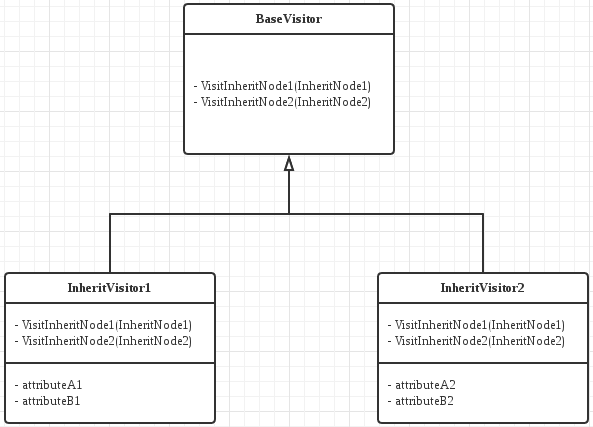

## 1
- 解释函数```gettok()```如何向调用者传递```token```类别、```token```语义值(数字值、变量名)
	- 定义枚举类型，则可以根据gettok的返回值得到token的类别
	```cpp
    enum Token {
  		tok_eof = -1,
  		// commands
  		tok_def = -2, tok_extern = -3,
  		// primary
  		tok_identifier = -4, tok_number = -5
	};
    ```
    - 全局变量IdentifierStr用来保存变量名，NumVal用来保存数字值
    ```cpp
    static std::string IdentifierStr;  // Filled in if tok_identifier
	static double NumVal;              // Filled in if tok_number
    ```

## 2
- 解释```ExprAST```里的```virtual```的作用,在继承时的原理(解释vtable).```virtual```在MP1的support code里面也出现了.这个问题是希望大家理解C++的继承.
	- 基类的虚函数是希望派生类声明自己的版本以覆盖基类的虚函数版本。析构函数一般会被设定为虚函数。原因主要是:
		- 根据对象的动态类型调用对应的虚函数。像下例中，```Base```类的析构函数没有被声明为虚函数，在```delete pb```调用析构函数时就会根据pb的静态类型```Base```调用```Base```的析构函数。这样```Inherit```的```data```的内存就没有被释放。如果把```Base```的析构函数改为虚函数，在```delete pb```调用析构函数时就会根据pb的动态类型```Inherit```调用```Inherit```的析构函数，把```data```的内存释放掉。
		```cpp
	    #include <iostream>
		class Base
		{
		public:
    		  ~Base() { std::cout << "Base" << std::endl; };
		};
		class Inherit : public Base
		{
		public:
			  int *data = new int(2333);
    		  ~Inherit() { delete data; }
		};
		int main()
		{
    	      Base *pb;
    		  Inherit *pin = new Inherit();
    		  pb = pin;
    		  int *test = pin -> data;
    		  std::cout << *test << std::endl;
    		  delete pb;
    		  std::cout << *test << std::endl;
		}
        输出:
        2333
		Base
		2333
    	```
	- 继承时的原理
		- 单继承
			- 虚函数表的布局: 每个虚函数都被指派一个固定的索引值，相同的虚函数对应的相对虚函数表指针的偏移量相同。因此不管对象的动态类型是什么，只要对应指定的偏移就能成功调用指定的虚函数
		- 多继承
			- 虚函数表的布局: 派生类的虚函数接在第一个父类的虚函数表后，然后是另外几个基类的虚函数表。
- 解释代码里的```<std::unique_ptr>```和为什么要使用它?
	- ```std::unique_ptr```独自拥有它指向的对象。因此其拷贝构造函数和拷贝赋值运算符都被定义为删除的(或private的)，导致AST组分的对象不能被拷贝。这正符合一个AST组分对象是独有的。
	- C++智能指针的优越性，会自动在离开作用域后调用析构函数
- 阅读```src/toy.cpp```中的```MainLoop```及其调用的函数.阅读```HandleDefinition```和```HandleTopLevelExpression```,忽略```Codegen```部分,说明两者对应的```AST```结构.
	- ```HandleDefinition```是专门用来处理函数结构的，通过调```ParseDefinition```再调```ParsePrototype```得到参数列表，最后```ParseExpression```得到函数内的表达式，生成```FunctionAST```对象
	- ```HandleTopLevelExpression```调```ParseTopLevelExpr```再调```ParseExpression```得到Expression，相当于是一个```Prototype```为空的```FunctionAST```对象
<pre>
 |
 └──HandleDefinition
    	 └── FunctionAST
         	├── ExprAST
         	└── PrototypeAST
             	├── ArgNames
             	└── FnName
|
└── HandleTopLevelExpression
          └─── FunctionAST
               ├── ExprAST
               └── AnonymousADT(空的ArgNames与FnName)
</pre>
- &nbsp;```Kaleidoscope```如何在```Lexer```和```Parser```间传递信息?(token、语义值、用什么函数和变量)
	- token: 用```CurTok```来表示当前的token，用```getNextToken```获取下一个token，```getNextToken```里面调用了```Lexer```的```gettok```
	- 语义值: 全局变量IdentifierStr用来保存变量名，NumVal用来保存数字值
    ```cpp
    static std::string IdentifierStr;  // Filled in if tok_identifier
	static double NumVal;              // Filled in if tok_number
	```
- &nbsp;```Kaleidoscope```如何处理算符优先级(重点解释```ParseBinOpRHS```)?解释```a*b*c、a*b+c、a+b*c```分别是如何被分析处理的?
	- 先调用```ParseExpression```，用```ParsePrimary```得到LHS(left hand side)，然后由```ParseBinOpRHS```处理后半部分
    <pre>
    expression ::= primary binoprhs
    binoprhs ::= binop primary
    			 | binoprhs binop primary
    binop ::= '&lt;' | '+' | '-' | '*'
    </pre>
    - **注: 下面用到的LHS里面的括号并不实际存在，只是表明AST结构**
    - ```a * b * c```
    	- ```ParsePrimary```走```tok_identifier```分支，得到```a```。然后调```ParseBinOpRHS(0, LHS)```，```LHS```此时为```a```
    	- 得到```*```，优先级大于0，接着```ParsePrimary```走```tok_identifier```分支，得到```b```。发现下个仍然是```*```，优先级一样，```LHS```变为```a * b```，可见为左结合。然后```ParsePrimary```走```tok_identifier```分支，得到```c```。然后下一个不是运算符，```LHS```变为```(a * b) * c```，```TokPrec```为0， 返回```LHS```
    - ```a * b + c```
    	- ```ParsePrimary```走```tok_identifier```分支，得到```a```。然后调```ParseBinOpRHS(0, LHS)```，```LHS```此时为```a```
    	- 得到```*```，优先级大于0，接着```ParsePrimary```走```tok_identifier```分支，得到```b```。发现下个是```+```，优先级低于```TokPrec```，因此```LHS```变为```a * b```，可见```*```优先级高于```+```。然后```ParsePrimary```走```tok_identifier```分支，得到```c```。然后下一个不是运算符，```LHS```变为```(a * b) + c```，```TokPrec```为0， 返回```LHS```
    - ```a + b * c```
    	- ```ParsePrimary```走```tok_identifier```分支，得到```a```。然后调```ParseBinOpRHS(0, LHS)```，```LHS```此时为```a```
    	- 得到```+```，优先级大于0，接着```ParsePrimary```走```tok_identifier```分支，得到```b```。发现下个是```*```，优先级高于```TokPrec```，因此```RHS```为递归调用```ParseBinOpRHS```的结果。进入递归后，```TokPrec```为```*```，```ParsePrimary```走```tok_identifier```分支，得到```c```。然后下一个不是运算符，```LHS```变为```b * c```，```TokPrec```为0， 返回```LHS```，退出递归。然后```LHS```变为```a + (b * c)```。然后下一个不是运算符，```TokPrec```为0， 返回```LHS```
- 解释```Error、ErrorP、ErrorF```的作用,举例说明它们在语法分析中的应用。
	- ```Error```: 用于输出表达式错误信息，如二元运算符出现了除```+```, ```-```, ```*```, ```<```外的，或者使用了函数参数列表中不存在的变量，或者调用的函数还未定义，或者调用函数时参数数量不对，或者在需要```primary```时得到的不是```(```、```tok_identifier```、```tok_number```，或者有左括号但没有右括号，参数列表中```tok_identifier```或```tok_number```后既不是')'也不是','
	- ```ErrorP```: 用于输出prototype(函数名+参数列表)错误信息，例如缺少函数名，缺少左、右括号
	- ```ErrorF```: 用于输出函数错误信息，例如函数重定义，或重定义同名但参数列表不同的函数
- ```Kaleidoscope```不支持声明变量和给变量赋值,那么变量的作用是什么?
	- 变量可以作为函数的形式参数

## 3

- 解释教程3.2节中```Module```、```IRBuilder<>```的作用
	- ```Module```包含函数和全局变量，是```LLVM```的结构组分。这也是```LLVM IR```用来存放代码的顶层结构，它负责```IR```的内存，因此```codegen```返回的是```Value*```，而不是```unique_ptr```
	- ```IRBuilder<>```是模板类，它提供了统一的接口用于创建指令并把它们插入一个基本语句块，或者是插在基本语句块的末尾，或者是插在迭代器指向的特定位置
- 为何使用常量时用的函数名都是```get```而不是```create```?
	- 因为在```LLVM IR```中，常量都是共享的，且每个常量仅有一个
- 简要说明声明和定义一个函数的过程
	- 声明函数
		- ```PrototypeAST::codegen()```生成一个原型，返回函数指针(没有函数体，只有原型在LLVM IR中表示的就是函数声明)
		- 利用```FunctionType::get```获取原型的类型，它是接受一组double作为参数并返回double且不是变长参数的类型。这一类型供下面```Function::Create```使用
		- 利用```Function::Create```生成对应原型的IR函数指针，可以指定是否在模块外可用，此指针为返回的结果
		- (可选)根据原型提供的名字给函数的每个参数设置名字，名字不变可以提高IR可读性，让后续代码直接根据名字指定参数
	- 定义函数
		- ```FunctionAST::codegen()```生成一个函数，并返回该函数的指针。
		- 首先需要检查，比如说这个函数在之前是否被定义过，或者说存在一个extern的外部函数。检查可以通过符号表查找来实现。
		- 然后就要为函数创建、插入所谓```Basic Block```。当函数中不存在控制流时，仅需要一个```Basic Block```。根据维基的说法，在```Basic Block```中是不存在分支的。因此如果存在控制流，就需要多个```Basic Block```。
		- 插入```Basic Block```后，就可以将函数的参数都加到```NamedValues```字典(map)中，以便之后访问(生成变量表达式时)。
		- 接着调用```codegen()```。从函数的抽象语法树根节点开始生成IR代码。
			- 如果有错误，那么该方法会创建返回空指针，将会调用```eraseFromParent```方法将函数删去，并返回```nullptr```。
			- 如果没有错误，接下来调用```Builder.CreateRet```完成函数的返回部分，即```LLVM ret instruction```，用于把控制流返回给调用者。下一步```verifyFunction```函数会测试生成的函数的IR代码的正确性，确认正确后，才会返回由原型调用```Codegen()```生成的函数体的指针

- 文中提到了visitor pattern,虽然这里没有用到,但是是一个很重要的设计模式,请调研后给出解释(字数不作限制)
	- 可以看到，原来版本中，visitor方法分散到被访问对象的继承体系中，一旦需要增加访问方式，就必须修改被访问对象的继承体系以加入新的访问方法
		
	- 在使用visitor之后，把访问操作从被访问对象的继承体系分离出来，并实现visitor的继承体系。原来的访问操作变为accept方法中的```v -> VisitInheritNode(this)```
        
        
    - 优点
    	- 不需要改动被访问对象，增加新的访问方式只需要扩充visitor的继承体系，即增加visitor，易于增加新的访问方式。
    	- 把访问操作与其它无关操作分离开
    - 缺点
    	- 由于方便visitor访问，可能需要把一些东西向visitor公开(比如把visitor设置为友元)，破坏封装
    	- 如果需要经常扩充被访问对象的继承体系，需要经常把所有visitor更新，此时不太适宜使用visitor模式
	- 适用条件
		- 被访问对象继承体系变动不大，不需要经常增加新的被访问对象，但需要经常增加新的访问操作
		- 需要对对象继承体系中的对象进行一些访问操作，但和对象继承体系关系不大，需要把这些访问操作分离出来

# 参考资料
1. Lippman S B, 侯捷. 深度探索 C++ 对象模型[J]. M]. 北京: 华中科技大学出版社, 2001.
2. Gamma E, Helm R, Johnson R, et al. 设计模式: 可复用面向对象软件的基础[J]. 2000.