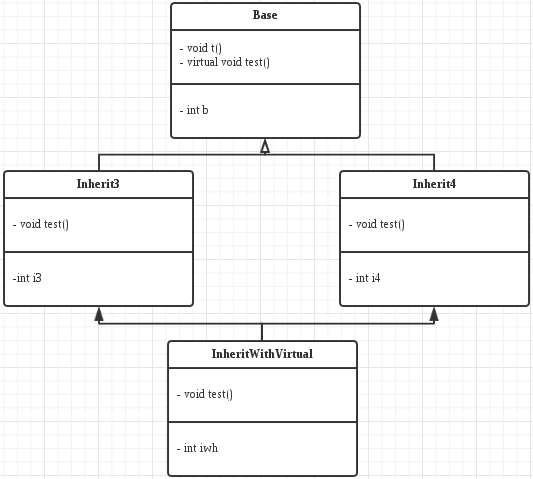
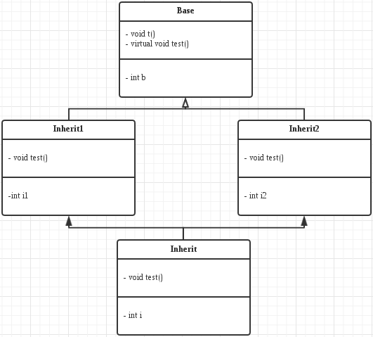

- 其中`InheritWithVirtual`使用了虚继承，只有一个A实例，`Inherit`有多个，因此在对`Inherit`的实例`inherit`使用`inherit.b`时会ambiguous，需要指明是哪个，例如`inherit.Inherit1::b`
- 继承图
   - 虚继承

   

   - 多继承

   
- 输出结果
<pre>
虚继承
InheritWithVirtual: 0x7ffdc434c770
t: 0x400cce
test: 0x400df8
b: 0x7ffdc434c798
i3: 0x7ffdc434c778
i4: 0x7ffdc434c788
iwv: 0x7ffdc434c78c

多继承
Inherit: 0x7ffdc434c7a0
Inherit1::t: 0x400cce
Inherit2::t: 0x400cce
test: 0x400dc6
Inherit1::b: 0x7ffdc434c7a8
Inherit2::b: 0x7ffdc434c7b8
i1: 0x7ffdc434c7ac
i2: 0x7ffdc434c7bc
i: 0x7ffdc434c7c0

(gdb) p b
$1 = {_vptr.Base = 0x401250 &lt;vtable for Base+16>, b = 0}
(gdb) p inherit
$2 = {&lt;Inherit1> = {&lt;Base> = {_vptr.Base = 0x4011f0 &lt;vtable for Inherit+16>, 
      b = 4198349}, i1 = 0}, &lt;Inherit2> = {&lt;Base> = {
      _vptr.Base = 0x401208 &lt;vtable for Inherit+40>, b = 0}, i2 = 0}, 
  i = 4198272}
(gdb) p inheritwithvirtual
$3 = {&lt;Inherit3> = {&lt;Base> = {
      _vptr.Base = 0x401120 &lt;vtable for InheritWithVirtual+88>, b = 4197488}, 
    _vptr.Inherit3 = 0x4010e0 &lt;vtable for InheritWithVirtual+24>, 
    i3 = 4197466}, &lt;Inherit4> = {
    _vptr.Inherit4 = 0x401100 &lt;vtable for InheritWithVirtual+56>, i4 = 65535}, 
  iwv = 1}
</pre>

- 实现特点
   - 因此可以看出内存布局情况
      - 虚继承
      1. 继承顺序的第1个类的部分(Inherit3)
      2. 继承顺序的第2个类的部分(Inherit4)
      3. 自己的部分
      4. 虚基类的公共部分
      - 多继承
      1. 继承顺序的第1个类的部分(Inherit1)，里面包含第1个类的基类部分
      2. 继承顺序的第2个类的部分(Inherit2)，里面包含第2个类的基类部分
      3. 自己的部分
   - 以上所说的是成员，对于成员方法，基类与派生类共享
   - 虚函数会有虚表指针，通过虚表指针获得虚函数地址来调用虚函数
   - 虚函数表
      - 虚继承   
         - 打出来的虚函数表不是很看得懂，会出现VTT(貌似用来构造虚函数表的virtual table table)，construction vtable等奇怪的东西
      - 多继承
         - 下面打了一下虚函数表，如上例，可以发现，会混入奇怪的`type_info`，查了一下是`RTTI`用的，可用来比较对象的类型是否相同
         <pre>
            (gdb) p inherit
            $109 = {&lt;Inherit1> = {&lt;Base> = {_vptr.Base = 0x4011f0 &lt;vtable for Inherit+16>, 
                b = 4198349}, i1 = 0}, &lt;Inherit2> = {&lt;Base> = {
                _vptr.Base = 0x401208 &lt;vtable for Inherit+40>, b = 0}, i2 = 0}, 
            i = 4198272}
            (gdb) p ((char*)0x4011e0)
            $126 = 0x4011e0 &lt;vtable for Inherit> ""
            (gdb) p (long*)*((long*)0x4011e8)
            $110 = (long *) 0x4012a8 &lt;typeinfo for Inherit>
            (gdb) p (long*)*((long*)0x4011f0)
            $111 = (long *) 0x400d6a &lt;Inherit::test()>
            (gdb) p (long*)*((long*)0x4011f8)
            $112 = (long *) 0xfffffffffffffff0
            (gdb) p (long*)*((long*)0x401200)
            $113 = (long *) 0x4012a8 &lt;typeinfo for Inherit>
            (gdb) p (long*)*((long*)0x401208)
            $114 = (long *) 0x400d95 &lt;non-virtual thunk to Inherit::test()>
            (gdb) p (long*)*((long*)0x401210)
            $115 = (long *) 0x0
            (gdb) p (long*)*((long*)0x401218)
            $116 = (long *) 0x401360 &lt;typeinfo for Inherit2>
            (gdb) p (long*)*((long*)0x401220)
            $117 = (long *) 0x400cd6 &lt;Inherit2::test()>
            (gdb) p (long*)*((long*)0x401228)
            $118 = (long *) 0x0
            (gdb) p (long*)*((long*)0x401230)
            $119 = (long *) 0x401388 &lt;typeinfo for Inherit1>
            (gdb) p (long*)*((long*)0x401238)
            $120 = (long *) 0x400caa &lt;Inherit1::test()>
            (gdb) p (long*)*((long*)0x401240)
            $121 = (long *) 0x0
            (gdb) p (long*)*((long*)0x401248)
            $122 = (long *) 0x4013b0 &lt;typeinfo for Base>
            (gdb) p (long*)*((long*)0x401250)
            $123 = (long *) 0x400c7e &lt;Base::test()>
            (gdb) p (long*)*((long*)0x401258)
         </pre>

- 使用方法
   - 虚继承要加`virtual`关键字，继承需要在类名后面加上基类列表

- 遇到的问题
   - 一开始成员用`char`，然后取成员地址打不出来，以为`cout`会按字符串来处理，所以我改成用`int`，其实也可以强转`(int*)char*`